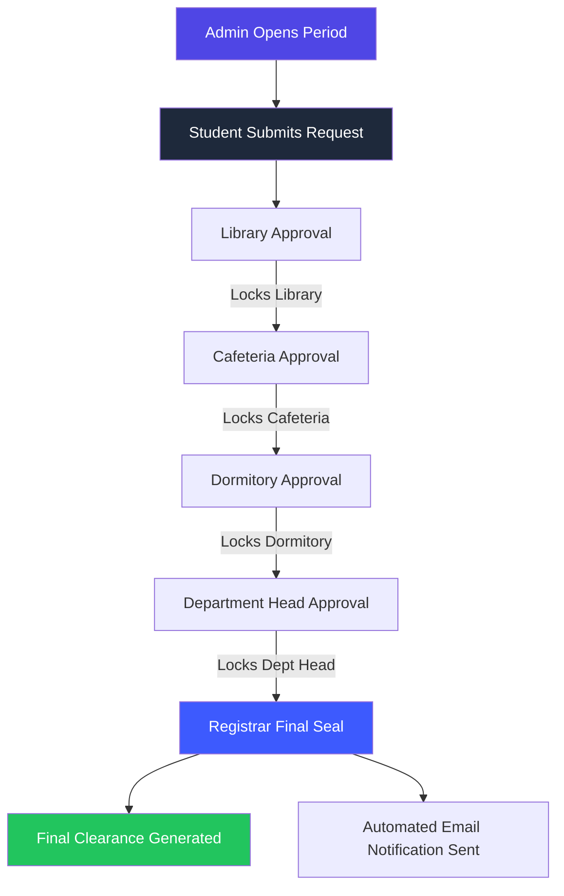

# 🎓 DBU Clearance Management System
### *State-of-the-Art Digital Clearance Solution for Debre Berhan University*

---

## 📝 Overview
The **DBU Clearance System** is a comprehensive web-based platform designed to digitize and streamline the traditional manual student clearance process. It provides a synchronized ecosystem for students, department heads, administrative offices, and the registrar to manage clearance requests with speed, transparency, and security.

---

## 🛠️ Technology Stack
| Layer | Technologies |
|---|---|
| **Frontend** | React.js, Tailwind CSS, Vite, Axios, Framer Motion |
| **Backend** | Node.js, Express.js |
| **Database** | MySQL (with connection pooling) |
| **Authentication** | Session-based Auth, Bcrypt.js (Password Hashing) |
| **Communication** | Nodemailer (SMTP Service), DNS MX Record Verification |
| **Storage** | Multer (Profile Picture & Document uploads) |
| **Typography** | Google Fonts (Outfit, Inter) |

---

## 🕹️ Core Functionality

### 1. 👨‍🎓 Student Portal
- **Dashboard**: Real-time overview of clearance status, dynamic 3-day window countdown, and unread notifications.
- **Clearance Requests**: One-click application for university clearance.
- **Smart Chatbot**: AI-powered assistant to answer frequently asked questions about the process.
- **Profile Management**: Secure profile updates with photo uploads and real-time email domain verification.
- **Certificate Access**: Instant download of the clearance certificate once finalized.

### 2. 👨‍💼 Administrative Ecosystem
- **System Admin**: Complete control over clearance windows (activation/scheduling), student data management, and admin auditing.
- **Departmental Admins**: Specialized dashboards for Library, Cafeteria, Dormitory, Department Head, and Personal Protector.
- **Registrar Office**: The final authority to review all approvals and issue the final clearance certificate.
- **Bulk Actions**: Support for handling hundreds of approvals simultaneously.

### 3. 📧 Notification System
- **Real-time Emails**: Automated confirmation sent to students for approvals, rejections (with reasons), and account creation.
- **Smart Badging**: Dynamic UI badges in the sidebar and top navigation for unread notifications.

---

## 🔄 System Workflow & Approval Logic

The DBU Clearance System follows a strict **Sequential Chain of Responsibility** to ensure all university property is returned and obligations met before a student is cleared.

### 🌊 The Clearance Chain
1. **System Activation**: The System Admin opens the clearance window for the specific academic year.
2. **Student Request**: Students submit a clearance request through their portal.
3. **Sequential Approval**:
    - **Stage 1: Library** (Physical books & digital resources)
    - **Stage 2: Cafeteria** (Dining hall fees & equipment)
    - **Stage 3: Dormitory** (Housing items & key returns)
    - **Stage 4: Department Head** (Departmental equipment & grades)
    - **Stage 5: Registrar (Final Seal)** (Official records & certificate generation)

### 🔒 Adaptive Locking Mechanism
To balance security with administrative flexibility, the system employs a smart locking logic:
- **Decision Reversibility**: An administrator can toggle their decision (Approved ↔ Rejected) as long as the student has not been approved by the **next** department in the chain. 
    - *Example: The Library admin can "Undo" an approval if they find a mistake later, provided the Cafeteria has not yet approved that student.*
- **Permanent Lock**: Once a subsequent stage approves a student, all preceding approvals for that student become **permanently locked** to prevent tampering with a finalized chain.
- **Registrar Finality**: The Registrar's approval is the definitive action that mark's a student's system status as "Cleared" and triggers the generation of the Digital Clearance Certificate.

### 📊 Workflow Diagram


---

## 🚀 Getting Started

### Prerequisites
- Node.js (v14+)
- MySQL Server
- Gmail App Password (for SMTP)

### Installation
1. **Clone the repository**
   ```bash
   git clone https://github.com/your-repo/dbu-clearance.git
   cd dbu-clearance
   ```

2. **Setup Backend**
   - Create a `.env` file in the root directory:
     ```env
     DB_HOST=localhost
     DB_USER=root
     DB_PASSWORD=""
     DB_NAME=clearance
     EMAIL_USER=your-email@gmail.com
     EMAIL_PASS=your-app-password
     SESSION_SECRET=your_secret
     PORT=3000
     ```
   - Install dependencies: `npm install`
   - Import `schema.sql` into your MySQL database.

3. **Setup Frontend**
   - Navigate to `/client`
   - Install dependencies: `npm install`
   - Build assets: `npm run build`

4. **Run Application**
   ```bash
   npm start
   ```

---

## 📁 Project Structure
- **/client**: React frontend source code and design system.
- **/routes**: API endpoint logic (Modularized by role: student, admin, registrar, etc.).
- **/uploads**: Storage for profile pictures and documents.
- **server.js**: Entry point and middleware configuration.
- **schema.sql**: Database structure and seed data.

---

## 🛡️ Security Features
- **Route Guards**: Middleware-based protection ensures users can only access their authorized portals.
- **DNS Validation**: Real-time domain checking for email addresses to prevent fake registrations.
- **Hashed Secrets**: All passwords and session keys are encrypted using industry-standard protocols.

---
© 2025 Debre Berhan University. Digital Transformation Initiative.
